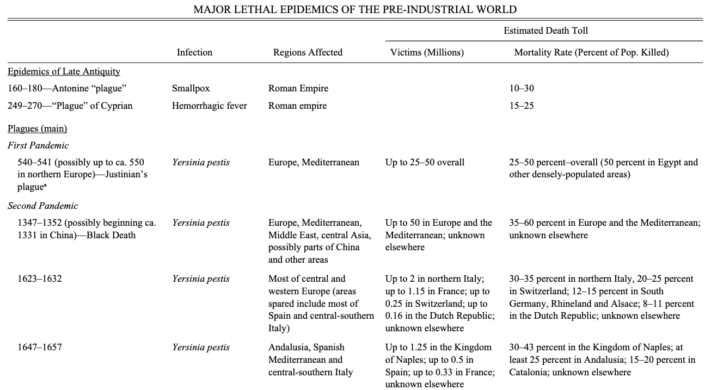
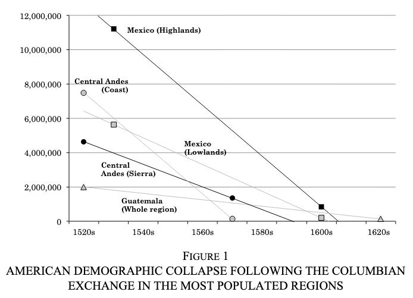
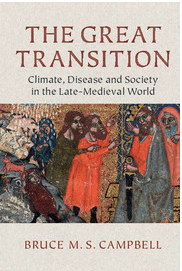
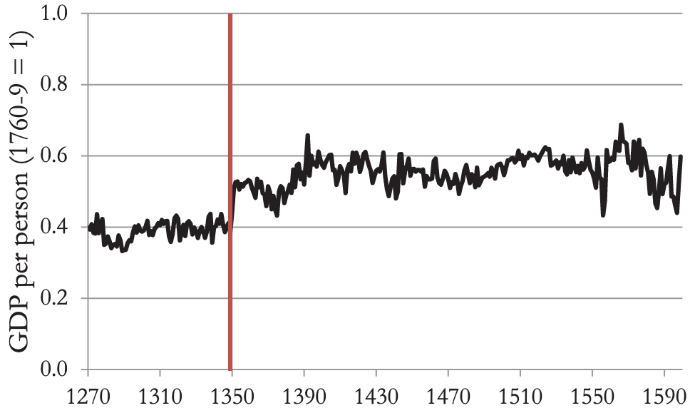
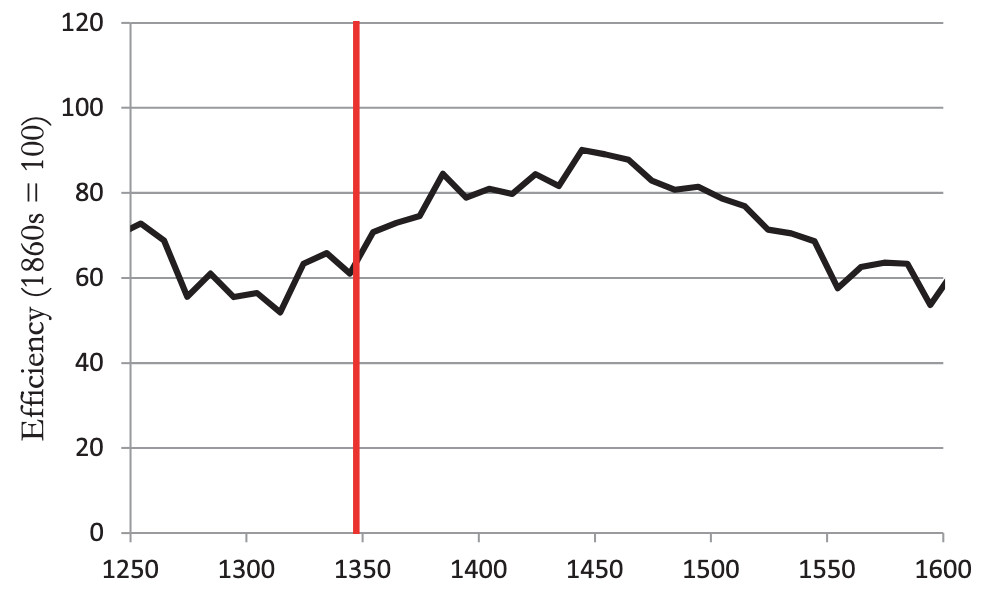
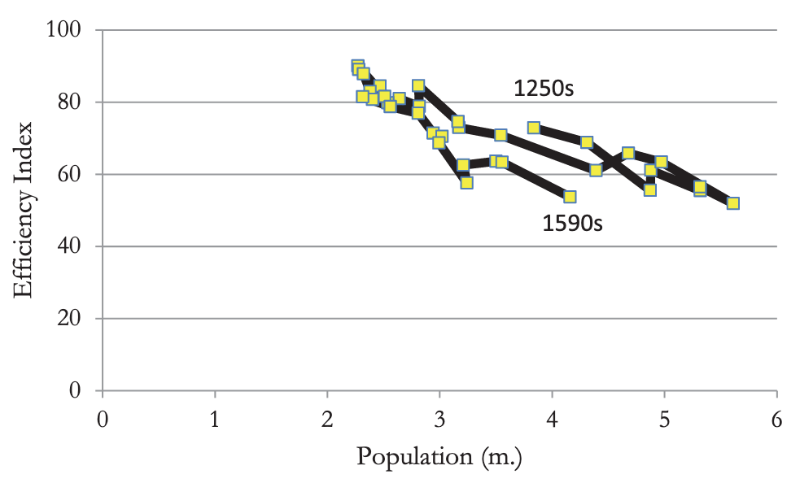

## Plagues and epidemics

::: incremental
-   History records several enormous epidemiological events that
    severely impacted human population
-   In particular, the mortality rate of the Black Death was unusually
    severe
-   What was the legacy of these enormous epidemiological shocks?
    -   What was the economic legacy of covid?
:::

## Major pre-industrial plagues

*Source*: @alfani2017, Table 1

## What is Plague?

> "In a strictly biological sense, plague is usually understood as an
> infection caused by the *Yersinia pestis* bacillus, identified in 1894
> by Alexandre Yersin" [@alfani2017, p. 315]

-   a bacterial infection

-   treatable today with standard antibiotics (although fears of
    antibiotic resistant plague emerging)

## Transmission vectors?

> "Under normal circumstances, *Yersinia pestis* cannot be transmitted
> directly from person to person. Classic accounts of the Black Death
> ...model transmission as involving first a rat epidemic and the rat
> flea as the vector carrying the pathogen to humans. This story is
> oversimplified" [@alfani2017, p 321].

-   Other types of fleas, maybe lice

-   Many types of animals can be carriers not just rats

## Transmission vectors?

> "...the infection spread across human populations with an efficacy and
> speed that run counter to the standard rat-to-rat flea and rat
> flea-to-human transmission model, puzzling paleobiologists and
> historians alike" [@alfani2017, p. 321]

-   Possible aerosol transmission if causes secondary pneumonia

-   Could allow human-to-human transmission

-   Possible human-parasite-human transmission?

## Other epidemiological catastrophes

::::: columns
::: {.column}
-   Infectious disease e.g. Cholera

-   The Columbian exchange:

    -   European infectious diseases vs American diseases like syphilis

    -   Enormous population collapse: disease + conquest
:::

::: {.column}

*Source*: @alfani2017, Figure 1
:::
:::::

## The experience of catastrophe

> “Our former hopes are buried with our friends. The year 1348 left us
> lonely and bereft, for it took from us wealth which could not be
> restored by the Indian, Caspian or Carpathian Sea. Last losses are
> beyond recovery, and death’s wound beyond cure. There is just one
> comfort: that we shall follow those who went before” Petrarch quoted
> in @belich2022, p. 1.

-   The experience 1/3 to 2/3 people around you dying is difficult to
    imagine.

    -   Covid 'made us crazy' but \~0.25-0.45% mortality rate

## Responding to Plague

> "We need to consider not only the nature of the pathogen but also the
> *human environment* and the action of the *institutions* trying to
> fight the epidemic" @alfani2017, p. 321-322.

-   What kinds of institutional responses to we see to the Black Death?

-   How do these responses mediate the impact of plague?

## The economic consequences of the Black Death

::: incremental
-   We could imagine reasons why the impact of a large mortality shock
    could be positive or negative

    -   negative: huge loss of people, talent, limits to specialization,
        potential disruption of trade, etc.

    -   positive: sudden increase in capital/labor ratio, huge jump in
        wages, respite from Malthusian pressure

-   Improvements in levels vs improvements in technique?
:::

## Economic consequences

::::: columns
::: column

Pessimists include @campbell2016 who stresses falls in output
:::

::: column
{width="100"}

Optimists include @belich2022 who thinks it was fundamental to Europe's
dominance: "\[the Black Death\] is the biggest missing piece, whose
inclusion casts new light on the whole" p. 3.
:::
:::::

## Black death and economic change

@belich2022 is interested in "This strange intersection of depopulation
and successful expansion..." and "This conjunction of terrible epidemics
with economic and technological advance..." (p. 2).

What do we know about how the economy responded?

## Black death and economic growth

*Source*: @clark2016, Figure 1

-   We have good reasons to think wages and output/person increased

## Black death and productivity

@clark2016 wants to measure *economic efficiency* across the black
death:

$$
\text{Efficiency}_t = \frac{\text{Output}_t}{\text{Input}_t}
$$

-   Not simply whether people got a wage increase, but if the nature of
    the economy changed

-   He estimates this using the real wage paid to labor, land and
    capital

## Black death and productivity

*Source*: @clark2016, Figure 9

-   He argues for a rise in efficiency and gradual fall

-   He thinks this is *driven by population change*

## Population and productivity?

*Source*: @clark2016, Figure 10

> "...the shock of the onset of the plague is not associated with any
> abrupt upturn in efficiency. There is instead a relatively smooth
> upwards movement as population contracts across this long interval"
> @clark2016, p. 157.

## Evaluating Clark (2016)

-   How do we interpret Clark's estimates of efficiency?

-   How should we interpret the negative relationship between efficiency
    and population?

-   Develop a critique based on his empirical strategy and his
    interpretation

## Works Cited
