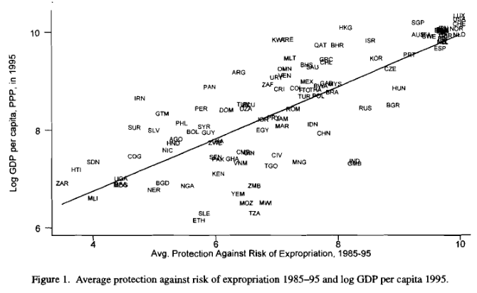
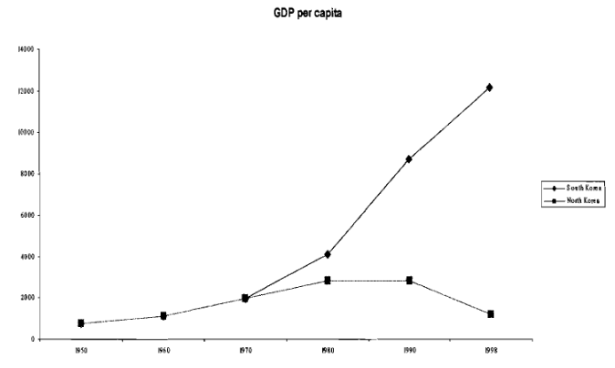
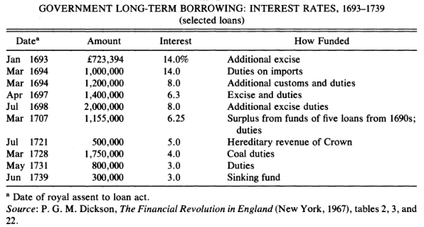
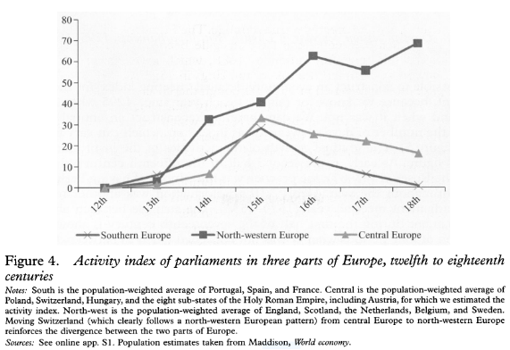
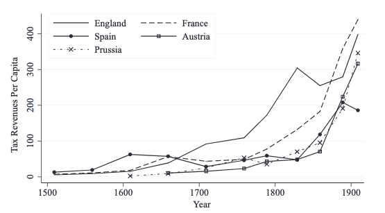

## Key questions

What is the relationship between differences in political order and
differences in economic outcomes?

*Source*: @acemoglu2005, Figure 1

## Institutions and Economic Development

::: incremental
-   A long theoretical tradition has argued for the importance of good
    *institutions* to understanding economic development [@north1989;
    @north1991; @acemoglu2005].

-   The rise of an institutional perspective was associated with the New
    Institutional Economics – which helped to bring history and politics
    back into the study of economic growth.

-   What is meant by **good**? What is meant by **institution**?
:::

## Institutions

> "Institutions are the humanly devised constraints that structure
> political, economic and social interaction. They consist of both
> informal constraints (sanctions, taboos, customs, traditions, and
> codes of conduct), and formal rules (constitutions, laws, property
> rights)" [@north1991]

-   How is this distinguished from similar concepts like culture?

-   How is it distinguished from geographical determinants?

-   How do we tackle the fundamental **endogeneity** problem?

## Institutions

*Source*: @acemoglu2005, Figure 3.

-   Often social scientists try to find places that are similar in
    culture and geography but differ in institutions.

-   Use these cases to assess the role of institutions in economic
    development

## What are 'good' institutions?

> "Institutions and the effectiveness of enforcement (together with the
> technology employed) determine the cost of transacting. Effective
> institutions raise the benefits of cooperative solutions or the costs
> of defection, to use game theoretic terms" [@north1991, p. 98].

-   Crucial to view that institutions can help is idea that institutions
    can shape transaction costs

-   The link between institutions and economic development runs through
    markets

## Early work on institutions and growth

::::: columns
::: column
An important early article was @north1989 arguing that the British
Glorious Revolution of 1688 led to parliamentary supremacy which
defended property rights spurring investment and growth
:::

::: column

*Source*: @north1989, Table 4
:::
:::::

-   Empirically contested now

## Parliaments vs Kings?

> "...North and Weingast argued that the institutional changes following
> the *coup d'etat* by William and Mary created the basis for the
> following period of rapid economic change in England. ...we try to
> broaden the scope of this debate by analysing the growth and
> development of European parliaments in the centuries before the French
> Revolution" @vanzanden2012, p 836.

-   What do early European parliaments typically look like?

-   Why do king's often depend on parliaments?

## The rise and fall of parliaments

*Source*: @vanzanden2012, Figure 4.

-   What accounts for the rise of parliaments?

-   What accounts for their decline?

## The rise of parliament

> "Our hypothesis is that Atlantic trade ...contributed to the process
> of West European growth ...by **inducing fundamental institutional
> change**. Atlantic trade... altered the balance of political power by
> enriching and strengthening commercial interests ... it contributed to
> the emergence of political institutions protecting merchants against
> royal power" @acemoglu, p. 562.

-   Elsewhere Atlantic revenue might strengthen monarch e.g. Spain
    [@vanzanden2012, p. 851]

## What about state capacity?

> "State capacity describes the *ability* of a state to collect taxes,
> enforce law and order, and provide public goods" @johnson2017, p. 2

Can combine two elements

1.  **Legal capacity**: can enforce rules across its territory
2.  **Fiscal capacity**: can college enough tax revenue to implement its
    policies

## Why state capacity?

> "...if there is a degree of consensus about which institutions led to
> the emergence of sustained economic growth, what enabled some
> societies to adopt growth-enhancing institutions, but prevented other
> societies from doing so?" @johnson2017, p. 3.

-   Having institutions *do the right thing* presupposes that they can
    do things at all!

## Historical variation in tax capacity

*Source*: @johnson2017, p. 4.

## How did state capacity matter for growth?

::: incremental
1.  Protection from external predation
2.  States and markets as complements
3.  Effective bureaucracy
4.  Generalized rule-of-law
5.  Nation building
:::

## Works Cited
