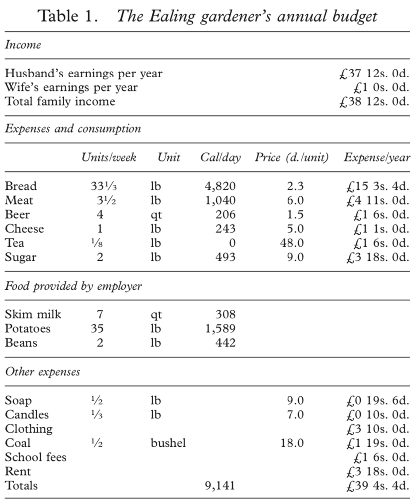

## Key questions about the British IR

::: incremental
-   Why in the 18th century?
-   Why in Britain?
-   Why in Europe?
:::

## Some early views {.smaller}

**Geography**

-   Britain was an island (security) [@obrien2011] with easy access to
    coal [@pomeranz2002]
-   Some comparative evidence that access to coal mattered for growth
    [@fernihough2021]

. . .

**Slavery & Imperialism**

-   The **Williams Thesis**: an influential argument for the importance
    of slave-trade and broader atlantic trade [@williams1944]

-   Two mechanisms (at least):

    1.   Direct demand/investment channel – harder to argue because
        small [@mokyr1977] but see [@berg2021]

    2.  Indirect linkages channel: institutions and industries
        [@berg2013; @berg2021; @zahedieh2021; @zahedieh2021a;
        @inikori1987]

## Allen on Why the Industrial Revolution was British {.smaller}

::::: columns
::: {.column width="60%"}
```{r allen_graph, fig.align='center', fig.retina=3, out.width="100%"}
library(DiagrammeR)

mermaid("
graph LR
  A((Commercial<br>Revolution)) --> B((Wages))
  C((Geography)) --> D((Energy<br>Prices))
  B((Wages)) --> F((Innovation))
  D((Energy<br>Prices)) --> F((Innovation))
  E((Capital<br>Prices)) --> F((Innovation))
  A --> G((Machine<br>Tools))
  G --> F
  B --> H((Education/<br>Training))
  H --> F
  A --> I((Urbanization))
  I --> D
  D --> E
style I fill:#93a1a1
style A fill:#93a1a1
style B fill:#93a1a1
style C fill:#93a1a1
style D fill:#93a1a1
style E fill:#93a1a1
style F fill:#93a1a1
style G fill:#93a1a1
style H fill:#93a1a1
")
```
:::

::: {.column width="40%"}
-   Allen's theory [@allen2009; @allen2011a] is multi-causal

    -   High relative wages are one important component

-   He mainly wants to explain the adoption of technology in production
    -- industrial innovation

-   Methodologically he insists on a **comparative** view: why Britain
    as opposed to elsewhere?
:::
:::::

## Allen: Core causal mechanism {.smaller}

::::: columns
::: {.column width="60%"}
```{r allen_graph_3, fig.align='center', fig.retina=3, out.width="100%"}

mermaid("
graph LR
  A((Commercial<br>Revolution)) --> B((Wages))
  C((Geography)) --> D((Energy<br>Prices))
  B((Wages)) --> F((Innovation))
  D((Energy<br>Prices)) --> F((Innovation))
  E((Capital<br>Prices)) --> F((Innovation))
  A --> G((Machine<br>Tools))
  G --> F
  B --> H((Education/<br>Training))
  H --> F
  A --> I((Urbanization))
  I --> D
  D --> E
style I fill:#93a1a1
style B fill:#dc322f
style D fill:#dc322f
style E fill:#dc322f
style A fill:#93a1a1
style C fill:#93a1a1
style F fill:#93a1a1
style G fill:#93a1a1
style H fill:#93a1a1
")

```
:::

::: {.column width="40%"}
-   The core elements of the theory are
    -   The price of labor
    -   The price of capital
    -   The price of energy
    -   In particular the focus is on **relative prices**
        -   High wage costs and low energy/capital costs incentivize
            switching machines for labor
        -   These are factors that effect the **demand** for innovation
            by firms
:::
:::::

## Allen: additional supply factors {.smaller}

::::: columns
::: {.column width="60%"}
```{r allen_graph_core, fig.align='center', fig.retina=3, out.width="100%"}

mermaid("
graph LR
  A((Commercial<br>Revolution)) --> B((Wages))
  C((Geography)) --> D((Energy<br>Prices))
  B((Wages)) --> F((Innovation))
  D((Energy<br>Prices)) --> F((Innovation))
  E((Capital<br>Prices)) --> F((Innovation))
  A --> G((Machine<br>Tools))
  G --> F
  B --> H((Education/<br>Training))
  H --> F
  A --> I((Urbanization))
  I --> D
  D --> E
style I fill:#93a1a1
style B fill:#93a1a1
style D fill:#93a1a1
style E fill:#93a1a1
style A fill:#93a1a1
style C fill:#93a1a1
style F fill:#93a1a1
style G fill:#dc322f
style H fill:#dc322f
")

```
:::

::: {.column width="40%"}
-   The **supply** of innovation increased by
    -   Availability of education
        -   Product of high wages (as education is costly)
    -   Availability of industries (like watches) linked to scientific
        thought and machine tools
    -   For Allen these are secondary factors
-   **Warning**: If quality of labor is too good implies the **real**
    wage may not be high
:::
:::::

## Allen: causes of the causes, why were wages high? {.smaller}

::::: columns
::: {.column width="60%"}
```{r allen_graph_4, fig.align='center', fig.retina=3, out.width="100%"}

mermaid("
graph LR
  A((Commercial<br>Revolution)) --> B((Wages))
  C((Geography)) --> D((Energy<br>Prices))
  B((Wages)) --> F((Innovation))
  D((Energy<br>Prices)) --> F((Innovation))
  E((Capital<br>Prices)) --> F((Innovation))
  A --> G((Machine<br>Tools))
  G --> F
  B --> H((Education/<br>Training))
  H --> F
  A --> I((Urbanization))
  I --> D
  D --> E
style I fill:#93a1a1
style B fill:#93a1a1
style D fill:#93a1a1
style E fill:#93a1a1
style A fill:#dc322f
style C fill:#dc322f
style F fill:#93a1a1
style G fill:#93a1a1
style H fill:#93a1a1
")
```
:::

::: {.column width="40%"}
-   Thinks wages grew through external trade/colonialism
-   Thinks low energy prices stem from geography: availability of coal
    deposits
    -   Also trade drives commercial adoption of coal through
        urbanization
-   Low energy prices subsidize cost of capital goods (coal used in
    producing iron, etc.)
:::
:::::

## Critiques of Allen {.smaller}

### Jane Humphries

-   In a series of papers criticized Allen's wage series
    [@humphries2013; @humphries2019]

-   Developed alternative accounts focused on low-wage precarious labor
    (women/children) [@humphries2020]

<!-- -->

-   In @humphries2013 argues family structure is unrealistic
    -   Need more than 3x a man's subsistence wage to support
        wife/children
    -   Therefore wage averaged over family is not high
    -   Implies probably women/children working $\rightarrow$ low wage
        labor

## Critiques of Allen {.smaller}

### Judy Stephenson

-   Re-examined a key wage series Allen relies on: builder's wages in
    London

> "...the bills that have been interpreted in the past as reports of
> wages received by labourers and craftsmen did not, in fact, state the
> pay of workers, but the rates charged by major building contractors to
> clients for types of service. ...Once contractors’ margins are taken
> into account, the actual wage in London construction was significantly
> below the levels reported in the series that have been used by Allen
> and others" [@stephenson2018].

Both critiques focus on the **measurement of wages**. Neither is
comparative.

## Mokyr on the Intellectual Origins of the Industrial Revolution {.smaller}

::::: columns
::: {.column width="60%"}
```{r mokyr_0, fig.align='center', fig.retina=3, out.width="100%"}

mermaid("
graph LR
  A((Enlightenment)) --> B((Scientific<br>Culture))
  C((Cultures of<br>Improvement)) --> D((Industrial<br>Enlightenment))
  D --> G((Knowledge<br>Production))
  A --> C
  B --> D
  D --> E((Access<br>Costs))
  E --> F((Innovation))
  G --> F
style A fill:#93a1a1
style B fill:#93a1a1
style C fill:#93a1a1
style D fill:#93a1a1
style E fill:#93a1a1
style F fill:#93a1a1
style G fill:#93a1a1
")


```
:::

::: {.column width="40%"}
-   From a number of books and papers [@mokyr2012; @mokyr2005;
    @kelly2014; @mokyr2021]
-   **cultural** account grounded in Enlightenment
    -   Cultures that produce **useful knowledge**
-   Prime movers are small fraction of high human capital individuals
-   Causal forces are broadly European
:::
:::::

## Mokyr on the Intellectual Origins of the Industrial Revolution {.smaller}

::::: columns
::: {.column width="60%"}
```{r mokyr_1, fig.align='center', fig.retina=3, out.width="100%"}

mermaid("
graph LR
  A((Enlightenment)) --> B((Scientific<br>Culture))
  C((Cultures of<br>Improvement)) --> D((Industrial<br>Enlightenment))
  D --> G((Knowledge<br>Production))
  A --> C
  B --> D
  D --> E((Access<br>Costs))
  E --> F((Innovation))
  G --> F
style A fill:#93a1a1
style B fill:#93a1a1
style C fill:#93a1a1
style D fill:#dc322f
style E fill:#93a1a1
style F fill:#93a1a1
style G fill:#93a1a1
")


```
:::

::: {.column width="40%"}
-   Core idea is a particular form of Enlightenment: **Industrial
    Enlightenment**
    -   More focussed on science/engineering than elsewhere
    -   Devoted to creating *useful knowledge*
    -   Entails strong links between scientists and manufacturers
:::
:::::

## Mokyr on the Intellectual Origins of the Industrial Revolution {.smaller}

::::: columns
::: {.column width="60%"}
```{r mokyr_2, fig.align='center', fig.retina=3, out.width="100%"}

mermaid("
graph LR
  A((Enlightenment)) --> B((Scientific<br>Culture))
  C((Cultures of<br>Improvement)) --> D((Industrial<br>Enlightenment))
  D --> G((Knowledge<br>Production))
  A --> C
  B --> D
  D --> E((Access<br>Costs))
  E --> F((Innovation))
  G --> F
style A fill:#93a1a1
style B fill:#93a1a1
style C fill:#93a1a1
style D fill:#93a1a1
style E fill:#dc322f
style F fill:#93a1a1
style G fill:#dc322f
")


```
:::

::: {.column width="40%"}
-   *Knowledge production*: both scientific but also descriptive
    -   Effect is more than cumulative as knowledge interacts
-   *Access costs* to information
    -   Learned societies
    -   Books/journals
    -   Encyclopedias
    -   Universities/Meeting places
:::
:::::

## Mokyr on the Intellectual Origins of the Industrial Revolution {.smaller}

::::: columns
::: {.column width="60%"}
```{r mokyr_3, fig.align='center', fig.retina=3, out.width="100%"}

mermaid("
graph LR
  A((Enlightenment)) --> B((Scientific<br>Culture))
  C((Cultures of<br>Improvement)) --> D((Industrial<br>Enlightenment))
  D --> G((Knowledge<br>Production))
  A --> C
  B --> D
  D --> E((Access<br>Costs))
  E --> F((Innovation))
  G --> F
style A fill:#93a1a1
style B fill:#dc322f
style C fill:#dc322f
style D fill:#93a1a1
style E fill:#93a1a1
style F fill:#93a1a1
style G fill:#93a1a1
")

```
:::

::: {.column width="40%"}
-   *Belief in progress* as attainable in many domains (politics,
    ethics, natural philosophy) seen as important cultural view
    -   Supports will to experiment in production
-   *Baconian science*:
    -   More empirical & concrete than e.g. Descartes
    -   More closely allied to applied scientific work
:::
:::::

## Critiques of Mokyr {.smaller}

### O'Brien

-   Mokyr inexplicably dismissive of the litany of other causal factors
    (geography, agriculture, institutions, etc) [@obrien2010].
-   Does not engage in *reciprocal comparison* -- comparing Britain to
    comparable units elsewhere in the world to ensure these mechanisms
    are absent
-   Does not really examine influence of Enlightenment ideas elsewhere

> "I conclude that an enlightened economy... are labels awaiting
> research and development to mature into operational concepts"
> [@obrien2010].

Mokyr's account is **not comparative**

## Critiques of Mokyr {.smaller}

### Atlantic economy critiques

-   A number of scholars have pointed to the Atlantic trade – in
    particular slavery and cotton [@berg2021; @zahedieh2021;
    @zahedieh2021a].

-   For others Atlantic trade is crucial in prompting institutional
    change or change in wage structure [@acemoglu; @allen2011a;
    @allen2009]

-   In their response @berg2021 make two key points:

    -   **Timing**: the skilled workers/apprentice/guild structure was
        old. When the IR occurred points to Atlantic Trade

    -   **Location**: IR highly regionally concentrated, growth of
        'Atlantic port hinterlands'

## Discussion {.smaller}

> Is Allen's focus on the incentives to adopt technology the right one?

. . .

> Does Mokyr's approach convince us that the industrial revolution would
> not have occurred without the Industrial Enlightenment?

. . .

> Does Humphries depiction of regular hunger and immiseration matter for
> Allen's argument? Is her criticism convincing?

. . .

> Are Berg & Hudson's objections to Mokyr convincing?

## How do we interpret the Ealing gardener's annual budget?



## Works Cited
