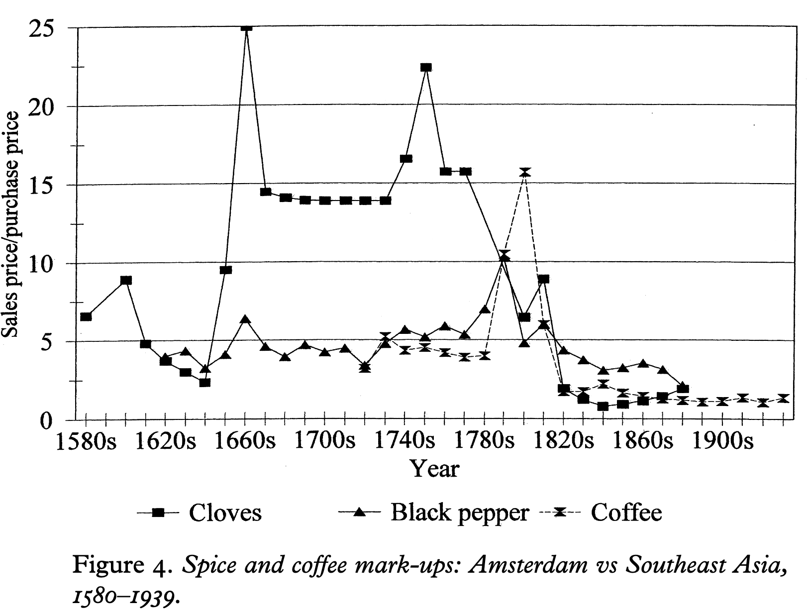
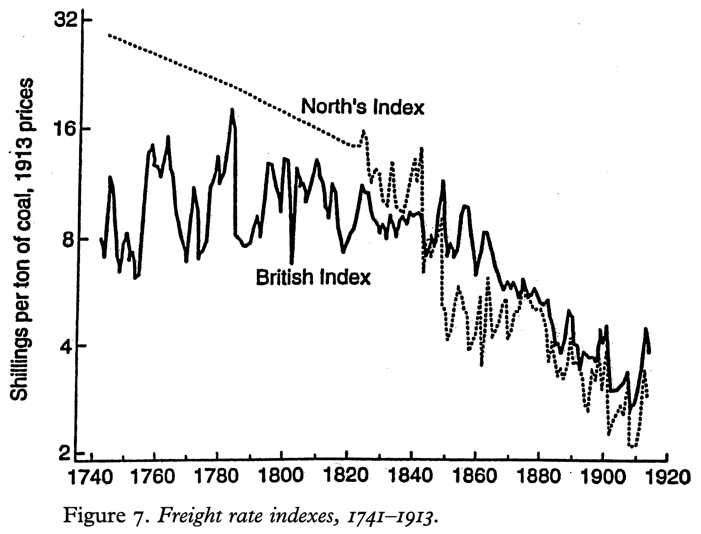
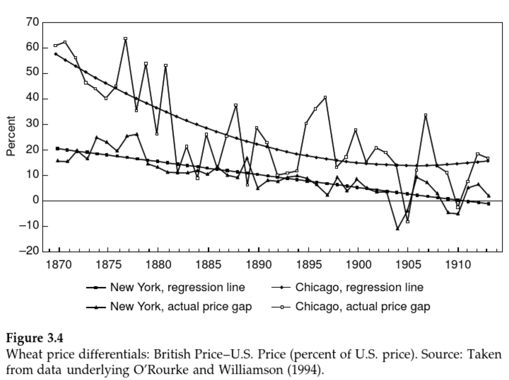
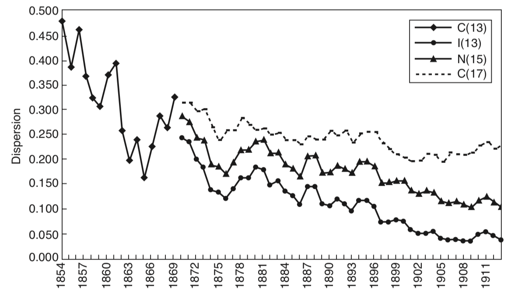
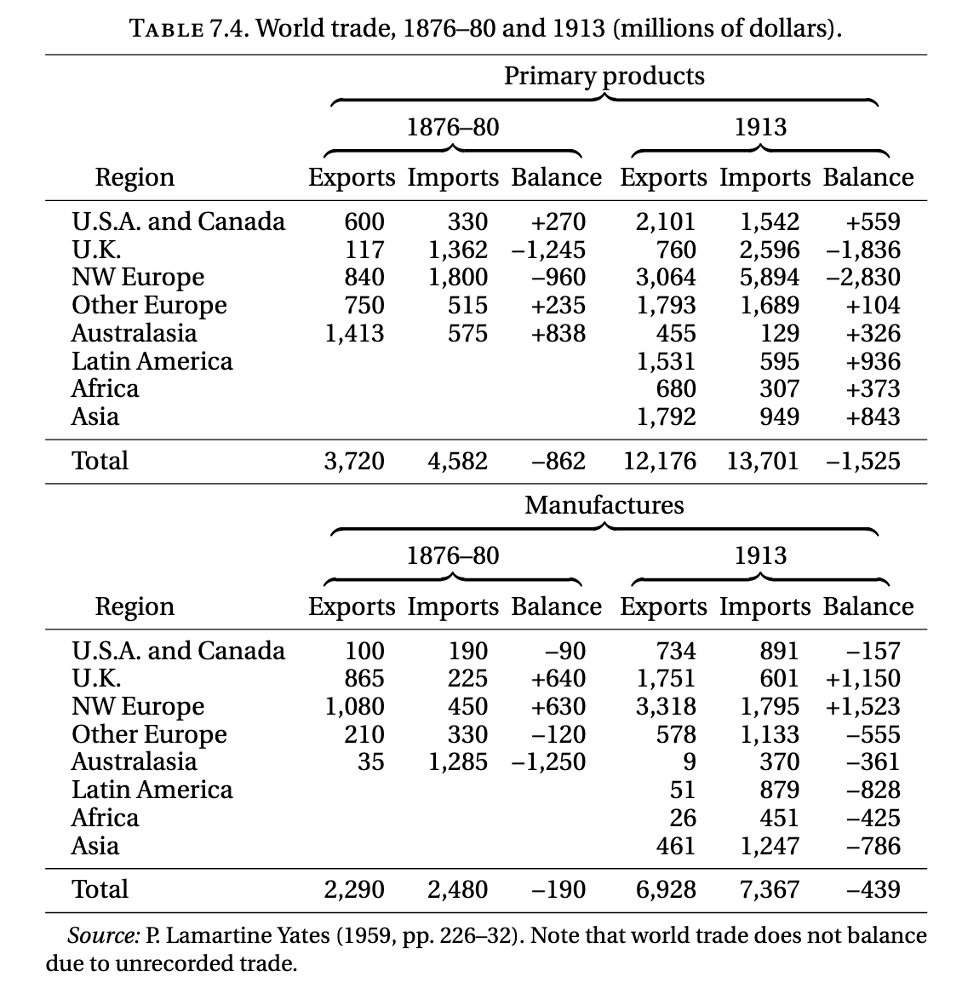
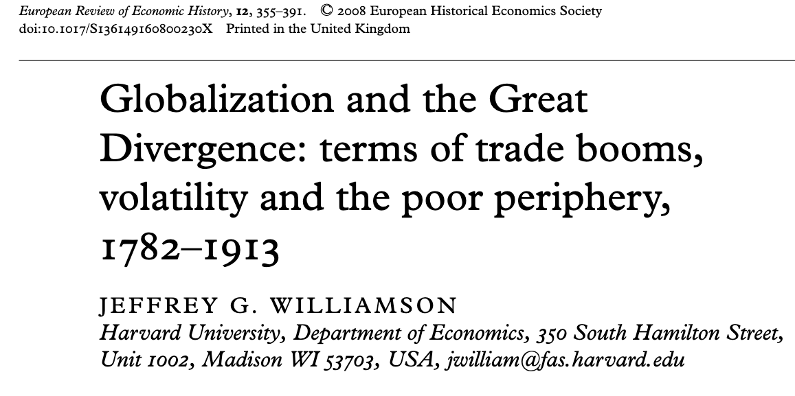
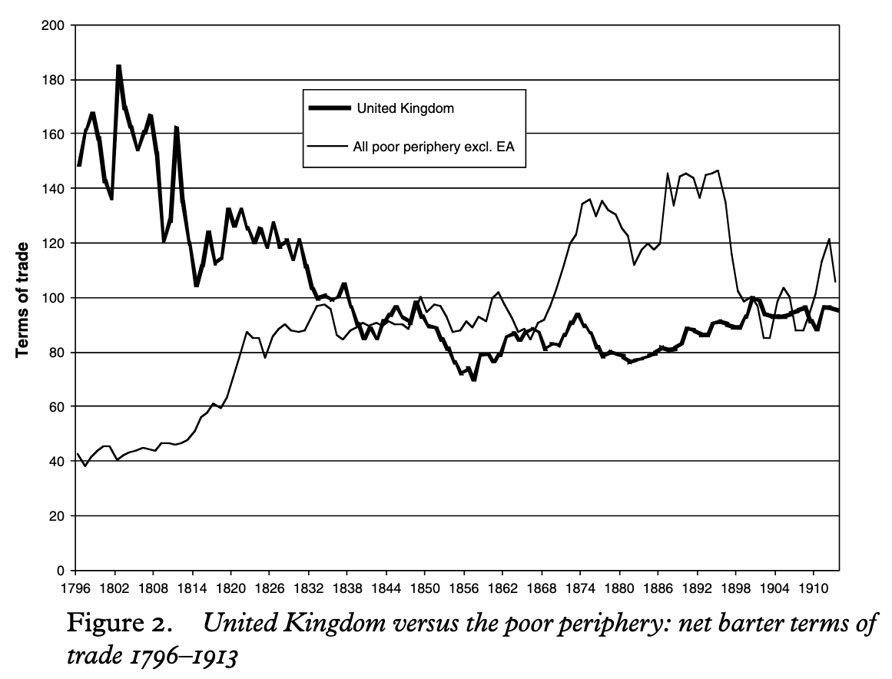
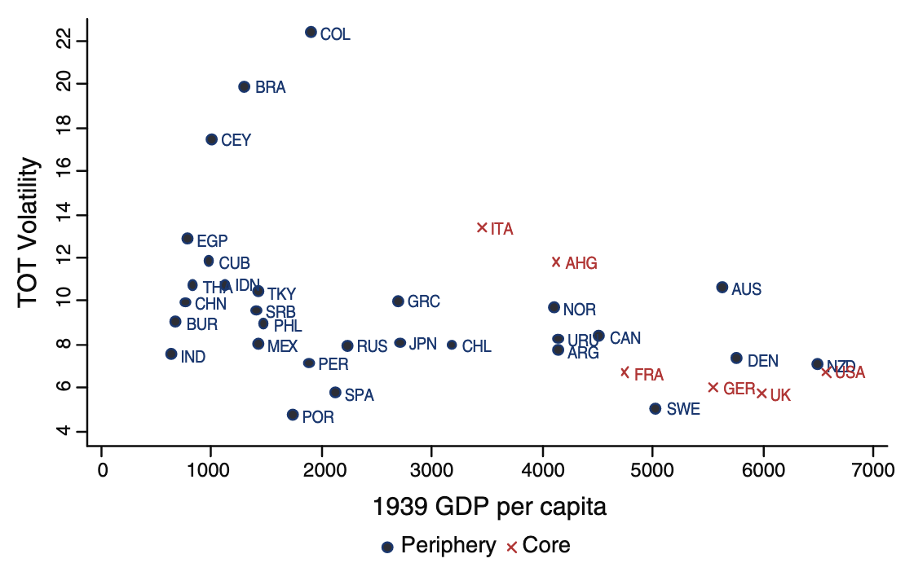

## Key questions

::: incremental
1.  When did economic globalization begin?
2.  What was the impact of economic globalization?

-   On rich countries?
-   On poor countries?

3.  Did economic globalization drive de-industrialization?
4.  Did it raise income volatility?
:::

## When does economic globalization occur? {.smaller}

-   There is a long tradition of global connection through trade

. . .

> "...China sold silk textiles to India throughout nearly two millenia
> from the early years of the Han dynasty (206 BCE to 220 CE) to the
> period of the Ming dynasty (1368-1644)" [@dale2009]

. . .

-   some argue pre-1500, many argue post-1500, some argue 18th/19th
    century

. . .

> "there was a single global world economy with a worldwide division of
> labour and multilateral trade from 1500 onward' Frank 1998 quoted in
> @orourke2002. p. 24.

## Plausible economic globalizations {.smaller}

#### Is connection enough?

> "The discovery of America, and that of a passage to the East Indies by
> the Cape of Good Hope, are the two greatest and most important events
> recorded in the history of mankind. ... By uniting, in some measure,
> the most distant parts of the world, by enabling them to relieve one
> another's wants, to increase one another's enjoyments, and to
> encourage one another's industry, their general tendency would seem to
> be beneficial." @smith2002, Book 4, ch. 7, part 3.

#### Or does scale matter?

> "What remains ... in doubt is the contemporary impact or significance
> of these new configurations of long-distance trade ... it is far less
> clear what meaning the new connections had for those who lived in the
> sixteenth or even the seventeenth century" @tracy1990

## The case for the 19th century {.smaller}

> "This article looks at **just one dimension of globalization,
> international commodity trade**..." @orourke2002, p. 24.

-   Trade volumes can fluctuate for many reasons
-   But commodity market integration should imply convergence in the
    prices of traded goods in different places

. . .

> "...the only irrefutable evidence \[of economic globalization\] is
> ...commodity price convergence" @orourke2002, p. 26.

## Why focus on prices?

@orourke2002 argue that for commodity market to affect domestic economic
life needs to do 2 things:

1.  alter the prices of local goods
2.  have the alteration cause local economic activity to change

. . .

-   For @orourke2002 economic globalization is substantial when you feel
    the pressure of foreign prices

-   Prices can matter even if flows are small

## The changing character of trade {.smaller}

::::: columns
::: column
#### pre-18th century

-   largely 'non-competing goods'
    -   Europe imp. spices/silk/sugar/gold
    -   Asia silver/linens/woolens

> "...spices were still 88 per cent of Asian imports into Lisbon by
> 1610" @orourke2002, p. 27.
:::

::: column
#### early-19th century

> "...price gaps between trading partners fell sharply ... globalization
> forces had a big income distribution impact on long-distance trading
> partners" @orourke2002, p. 27.
:::
:::::

**The argument**: 19th century trade becomes *qualitatively* different
because more focused on staples, transport costs lower, and prices start
to become global.

## Shipping costs and mark-ups {.smaller}

*Source*: @orourke2002

-   Monopoly and war keep transport costs high

-   Until the beginning of the 19th century

## The fall in shipping costs

*Source*: @orourke2002, Figure 7

## The impact of commodity market integration {.smaller}

*Source*: [@orourke1999]

-   Changes in transport costs and scale drive convergence in cost of
    foodstuffs

## Market integration: wages {.smaller}

*Source*: [@orourke1999]

-   Scale of trade pushes wages down in Americas and up in Europe

## A world of price externalities

> "...the unimaginably long and destructive American struggle, the
> world's first 'raw materials crisis', was midwife to the emergence of
> new global networks of labor, capital and state power." @beckert2004

. . .

> "From the 1840s through the 1860s, numbers on \[poor\] relief varied
> with the trade cycle, increasing during downturns and declining during
> booms. The Lancashire cotton famine, which affected only a small part
> of England and Wales, is clearly discernible..." @boyer2018, p. 86

## The great specialization {.smaller}

> "By 1913, international commodity markets were vastly more integrated
> than they had been in 1750, world trade accounted for a far higher
> share of world output, and a far broader range of goods, including
> commodities with a high bulk-to-value ratio, were being transported
> between continents. These trends ... had a dramatic impact on the
> worldwide division of labor... By the late nineteenth century there
> was a stark distinction between industrial and primary producing
> economies: the “Great Specialization,” as Dennis Robertson once
> memorably termed it (Robertson 1938, p. 6)." @findlay2009

. . .

-   Lower transport costs facilitate specialization over large spatial
    scales

-   Pattern begins to emerge between primary/secondary specialization
    and global income

## Specialization and Trade

{width="1530"}

*Source*: @findlay2009

## This leads naturally to...

-   @williamson2008 develops a timeline of terms of trade, divergence
    and growth

-   Developing ideas presented in @blattman2007

## The key idea: {.smaller}

> "...globalization fostered de-industrialization (e.g. specialization)
> in the periphery so that, according to modern theory, growth rates in
> the periphery fell behind" [@williamson2008, p. 357]

-   Focusing on primary product exports can raise incomes but lower
    long-run growth

> "...specialization in primary products must have meant greater price
> volatility in the periphery ...and thus ...even greater divergence in
> growth rates." [@williamson2008, p. 357]

-   If you concentrate on a small set of exports you have a lot of
    income volatility! This is bad for growth

## 4 Concepts worth knowing:

-   Net barter terms-of-trade
-   Dutch disease
-   Commodity lottery
-   Engels Law

## Key Concepts {.smaller}

#### Net Barter Terms of Trade

For each good $i$, for each country $j$, for each period $t$, you
calculate

$$
\text{NBTT}_{jt} = \frac{\sum_i p_{ijt}^X w_{ij}^X}{\sum_i p_{it}^M w_{i}^M}
$$

-   numerator: the sum of export prices (X) from country $j$ weighted by
    their share in imports

-   denominator: the sum of import prices (M) from everywhere weighted
    by their share of imports

-   This is an **index of export prices to import prices**

-   It is **the purchasing power of exports**: It tells us about how
    many bundles of goods you can purchase with your exports

## Key Concepts {.smaller}

#### Dutch disease

The text refers in places to 'Dutch disease'. This is economic jargon
for a problem that can arise with a high-value export sector

-   (modeled on the Netherlands in the 1960s exporting North Sea Oil):

1.  The high value export pulls in labor and capital and increases
    wages/rents
2.  Manufacturing sector cannot compete and shrinks
3.  Currency may rise because of foreign earnings (if floating)
4.  Non-tradeable services rise in price

## Key Concepts {.smaller}

#### The Commodity Lottery

Coined by Carlos Diaz-Alejandro and describes the process whereby:

> "Each country's exportable resources... were determined in large part
> by geography and chance, and differences in later economic development
> were a consequence of the economic, political and institutional
> attributes of each commodity" [@blattman2007, p. 160].

-   If you are blessed with e.g. silver you become specialized in silver
    export.

-   Your fortunes become tied to the global silver price: shocks (e.g.
    French demonetization of silver in 1873) can have a huge impact on a
    country's income.

## Key Concepts {.smaller}

#### Engel's Law

Not a law and not by *that* Engels.

An observation by German statistician Ernst Engel in 1857 which argues
that:

-   Share of consumption dedicated to primary products falls as income
    rises

-   So if you focus your production on primary products your income will
    grow more slowly than the overall growth rate

-   Applied to countries, this suggests countries specialized in primary
    products will grow more slowly than the world as a whole (growing
    divergence).

## Terms of trade in the long-run

*Source*: @williamson2008

## Volatility and growth

*Source*: @blattman2007, Figure 1

## Works Cited
