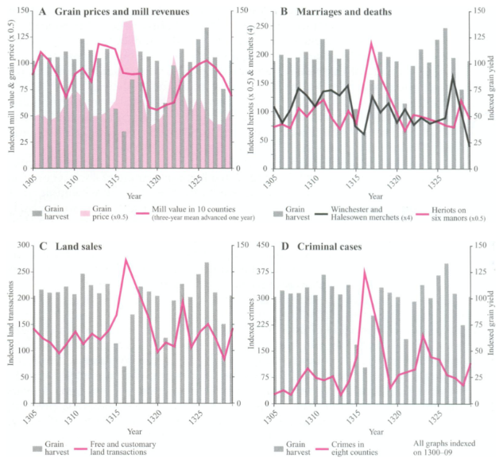
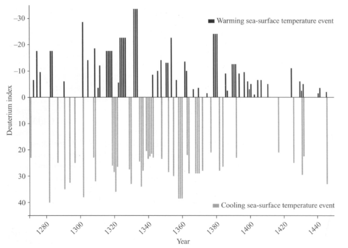
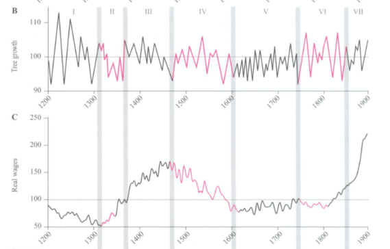
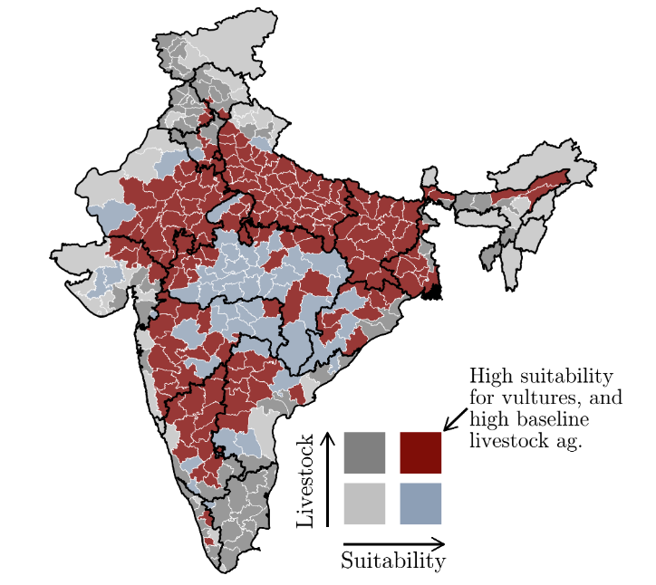
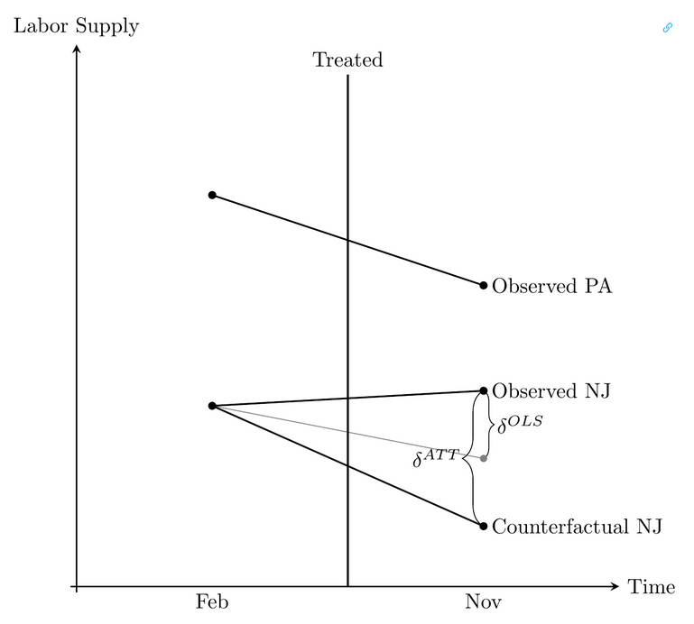

## Today's Plan

1.  Introduce economic history and the environment
2.  Discuss @campbell2010
3.  **Methods**: differences-in-differences as comparative cases
4.  Discuss @frank

## The anthropocentric problem

> "...a skeptic might feel justified in concluding that short-term
> climatic crises stand in relation to economic history as bank
> robberies to the history of banking" @devries1980, p. 603.

-   Traditionally, climate is acknowledged for specific shocks but not
    generally incorporated into economic history

-   The growing problem of global warming has increased interest in
    'environmental economics' and interaction of economy and environment

## The anthropocentric problem

> "Economic historians have long been inclined to seek and prefer
> historical explanations which ascribe primary importance to processes
> internal (that is, endogenous) to human society. Historians, too, tend
> to privilege the role of human agency. ...\[they share\] a common
> anthropocentric theoretical framework" [@campbell2010, p. 282].

-   Nature is acknowledged but key driving factors are human
    arrangements

## Obvious natural shocks: famines

**Source**: @campbell2010, Figure 5

## Origins of famine?

**Source**: @campbell2010, Figure 6

-   global pattern of abnormal temperature drove weather patterns

## Nature and economic growth

> "Medieval economic historians have long identified the years from *c.*
> 1270 to *c.* 1420 as an era of heightened socio-economic instability.
> It is equally clear that the changes then set in train had profound
> implications for development in the long term. Only recently has it
> become apparent that the same years likewise stand out in the physical
> environmental record as a time of increasingly unstable climatic
> conditions on hemispherical and global scales" @campbell2010, p. 305.

## New sources: tree-growth

> "...dendrochronologists have been reconstructing ...precise
> chronologies of tree growth spanning the last 8,000 years. ...For
> those of a statistical disposition who covet long time series, here
> are data of a range and precision 'beyond the dreams of intellectual
> avarice'" @campbell2010, p. 306-7.

-   New sources like tree growth and ice cores help to track historical
    change over long periods.

## Exercise: Figure 16 {.smaller}

::::: columns
::: column

:::

::: column
-   How can we use environmental sources to better understand economic
    and social history?

-   How does Campbell interpret this pattern?

-   Do you think this is evidence of an environmentally driven rhythm to
    economic history?

-   Do you think this tells us something about the economic impact of
    global warming? Why or why not?
:::
:::::

## Keystone species collapse

@frank study the impact of the collapse of the vulture population in
India on human health.

Mechanisms:

-   Vultures eat an **astonishing** amount of carrion

-   Keeps down feral dog/rat population

-   Keeps down environmental contamination of water supplies

## What accounts for species loss?

In this case, vultures were susceptible to a pharmaceutical *diclofenac*
given to cattle.

-   Only became widely given to animals after patent protection expired
    and generic is produced in 1990s

-   Causes kidney failure in vultures

-   95% fall in vulture population in the late 1990s

## How to measure the impact of species loss?

::: incremental
-   What are the problems with comparing across cases?

-   What are the problems with comparing across time periods?
:::

## What are we trying to measure? {.smaller}

The standard object of interest to quantitative social scientists is the
*average causal effect* (ACE) or *average treatment effect* (ATE) over
some population.

-   Why an average?

. . .

Individual causal effect (ICE) cannot be observed:
$ICE_i = y_i(1) - y_i(0)$

We observe: $y_i = T_i y_i(1) + (1 - T_i) y_i(0)$

. . .

ATE is a **counter-factual quantity**:

-   on average, what would your chance of dying be if you lived in a
    district with more vultures?

-   What would your probability of having a job be if you lived in a
    district with a higher minimum wage?

## Comparing across time and space: differences-in-differences {.smaller}

> "Using our habitat suitability measures, we then compare districts
> that had a significant vulture presence with those that did not,
> before and after the 1994 onset of diclofenac use. The key identifying
> assumption in this design is that both groups of districts would have
> seen their health outcomes develop along parallel trends in the
> absence of the collapse in vulture populations" @frank, p. 20

-   Key assumptions:

    -   *Change* in control is counterfactual

    -   Groups would *otherwise move in parallel*

## Differences-in-differences: minimum wage example {.smaller}

::::: columns
::: column
In 1990s @card1993 popularized DiD approaches to causal estimation using
a simple minimum wage example [@cunningham2021].

Setting:

-   In 1992 minimum wage in PA and NJ is both \$4.25

-   In November 1992 NJ raises minimum wage to \$5.05

-   @card1993 survey \~400 fast food stores across both states before
    and after minimum wage hike
:::

::: column
|                | PA     | NJ    | PA - NJ  |
|----------------|--------|-------|----------|
| **Emp. Pre**   | 23.3   | 20.44 | -2.89    |
| **Emp. Post**  | 21.147 | 21.03 | -0.14    |
| **Post - Pre** | -2.16  | 0.59  | **2.75** |

-   Employment per store in PA falls from Pre to Post

-   Employment per store in NJ rises from Pre to Post

-   **ACE** **for NJ stores is +2.75 employees**
:::
:::::

## Differences-in-differences: minimum wage example {.smaller}

-   Famous example of NJ vs PA minimum wage change

-   Time comparison is biased, and space comparison is biased

## Evaluating @frank

-   What do they find?

-   Do their assumptions make sense? What are the possible sources of
    bias in their method?

-   What are the mechanisms they think explain their result?

## Works Cited
