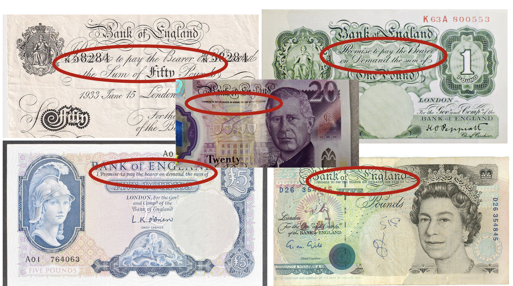
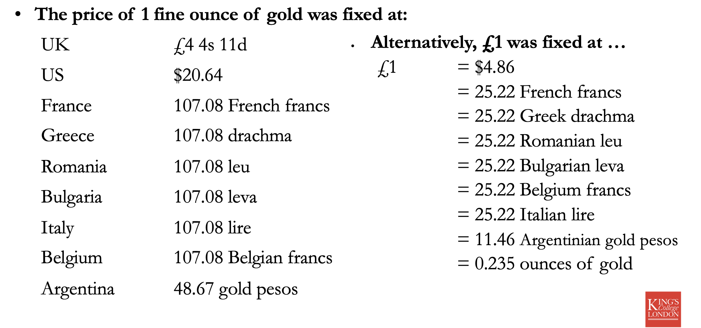
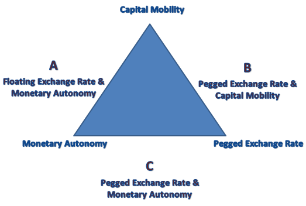
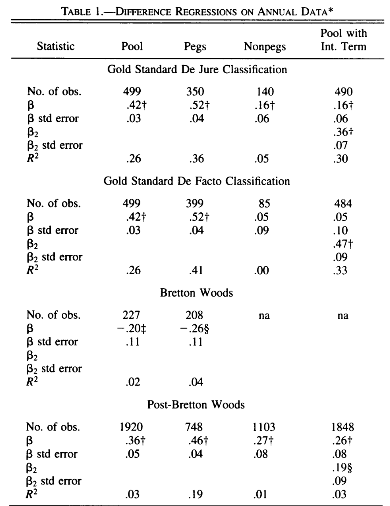
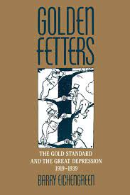

## Today's Plan

1.  What is a gold standard?
2.  International finance: the trilemma
3.  The rise and fall of the gold standard

## What is a gold standard?



## What is the gold standard?

> "This phrase dates from long ago when our notes represented deposits
> of gold. At that time, a member of the public could exchange one of
> our banknotes for gold of the same value."
>
> —Bank of England

-   Notes are convertible to a fixed amount of gold

-   This implies that notes of one currency convertible to a fixed
    quantity of notes of another currency

    -   This can fluctuate a little b/c of arbitrage costs

## What is the gold standard?



## Metallic standards

Over the course of the late-19th century many countries move towards an
exclusively *gold* standard. But not all, and other metallic standards
are common, e.g. China is on a *silver* standard.

It is common in mid-19th c. to have a **bimetallic** standard e.g. gold
and silver [@redish1990; @flandreau1996; @sargent2003]

-   In a bimetallic standard notes convert to fixed amount of *gold or
    silver*.

    -   Implies gold converts to a fixed amount of silver

## How does it work?

Ricardo and other 19th c. theorists developed the 'price-specie-flow'
mechanism to describe gold-standard:

::: incremental
1.  Say Britain runs a trade deficit buying more than it sells.
2.  Pays for difference in trade balance in gold.
3.  Stock of UK gold falls so money supply contracts.
4.  Contracting money supply leads to deflation so prices fall.
5.  Lower prices make UK exports attractive so trade deficit closes.
:::

## How does it work? Adding policy {.smaller}

Central banks could follow/defy the 'rules of the game' promoting or
blocking price adjustment.

::: incremental
1.  Bank of England sees gold being exported (b/c of trade deficit e.g.)
2.  BoE can raise interest rates, this will
    1.  Attract gold to the bank from investors seeking returns
    2.  Slow economic activity
3.  Both might push down prices restoring trade balance
4.  If the bank does **not** raise interest rates, risks
    **convertibility**!

-   Central banks could also 'defy' the rules of the game, particularly
    if gold is flowing *to* the country.

    -   Can *sterilize* gold flows by buying and storing imported gold
        preventing price increases and therefore adjustment.
:::

## 'Rules of the game' and international cooperation {.smaller}

A key idea of @eichengreen1992 is that the successful international gold
standard of the 19th century depended on central bank cooperation.

::: incremental
-   Imagine a country like e.g. Argentina is seeing gold exported to
    Britain.

-   They raise interest rates to attract gold back.

-   But Britain also raises interest rates to keep gold flow!

-   Argentina must now raise even higher (hurting economy) or risk
    losing so much gold they fall off gold standard.

    -   Risk of breaking convertibility can cause investors to export
        gold

    -   Credibility of gold-standard is a self-fulfilling prophesy
:::

## International finance and the gold standard {.smaller}

-   Under the international gold standard central banks worked to make
    sure that their *exchange rate remained stable* against other gold
    standard currencies [@flandreau].

    -   A system of **fixed exchange rates**

-   They did this mostly by using the interest rate to regulate the
    amount of gold in the country and held by the central bank.

    -   Interest rate policy is directed towards **exchange rate
        stability** not domestic economy.

-   Today central banks (e.g. BoE) have a different target: they aim at
    price stability and a steady rate of inflation.

## The trilemma

> "Policymakers in open economies face a macroeconomic *trilemma*.
> Typically they are confronted with three typically desirably, yet
> jointly unattainable, objectives:
>
> 1.  to stabilize the exchange rate;
> 2.  to enjoy free international capital mobility;
> 3.  to engage in a monetary policy oriented toward domestic goals."
>
> @obstfeld2005

## The trilemma



## The trilemma in history

::::: columns
::: column
Can pick **two** out of:

1.  Stable exchange rates
2.  free capital mobility
3.  and flexible domestic monetary policy
:::

::: column
1.  Classical gold standard (1870s-1914): 1 & 2
2.  Interwar gold standard (1918-1938): 1 & 2 but working poorly
3.  Bretton woods (1950s-1973): 1 & 3
4.  Current regime (1970s-present): mostly 2 & 3
:::
:::::

## The trilemma: *testing* historical monetary policy regimes {.smaller}

All the pieces of trilemma are **hard to measure**.

1.  Exchange rate stability is the easiest but still imperfect, e.g. if
    a currency is **officially** pegged, does it trade at the peg in
    **practice**?
2.  Capital mobility is difficult to track.
3.  How do we know if domestic monetary policy is being exercised
    'flexibly'?

-   @obstfeld2005 propose testing **short-run nominal interest rate
    deviations** from a global benchmark
-   What if domestic authorities 'flexibly' choose to follow the global
    benchmark?

## Testing the trilemma: Interest rates {.smaller}

Call the short-term interest rate of country $i$ at time $t$: $R_{it}$
and the global baseline rate $R_{bt}$.

Not straight-forward to test the relationship between $R_{it}$ and
$R_{bt}$: interest rates often have high **autocorrelation**. If
interest rate levels tend to drift in a given direction, this can lead
to a case of **spurious regression** — a common problem when studying
time series.

. . .

::::: columns
::: column
-   Any two variables with a **time-trend** will appear correlated
    -   E.g. annual measures since 1990 of my height and the number of
        times Nicholas Cage has been married
    -   Not causal (I don't think!)
:::

::: column
For more on spurious regression see: @granger1974
:::
:::::

## Testing the trilemma: Specifications (Hard! Don't panic)  {.smaller}

Focus on relationship between **changes** in interest rates ( $\Delta$
is often used to symbolize a difference over time)

$\Delta R_{it} = \alpha + \beta \Delta R_{bit} + u_{it}$

Then consider relationship including an **error-correction term**. If
interest rates diverge how long does it take for them to come back
together?

$\Delta R_{it} = \alpha + \beta \Delta R_{bit} + \theta (c + R_{i,t-1} - \gamma R_{bi,t-1}) + u_{it}$

If no arbitrage costs we predict $\beta = 1$. Practically, expect
$\beta$ to be much lower even if still binding.

## Results in differences  {.smaller}

::::: columns
::: column
-   Pegged currencies have $\beta$ coefficients that are larger
-   Gold standard and post-Bretton Woods have similar magnitude
    -   **But**: under Gold Standard this explains a lot more of the
        variation in interest rates
-   Some evidence for *fear of floating*
:::

::: column
{width="540"}
:::
:::::

------------------------------------------------------------------------

## Results with cointegration  {.smaller}

::::: columns
::: {.column width="60%"}
```{r, fig.align='center', fig.retina=4}
library(tidyverse)

df <- tibble(regime = c("1870-1914: Gold Standard", "1870-1914: Gold Standard", 
                             "1945-1973: Bretton Woods", 
                             "1973+: Post-Bretton Woods", "1973+: Post-Bretton Woods"),
             fixed = c("Peg", "Non-Peg", "Peg", "Peg", "Non-Peg"),
             theta = c(-.27, -.16, -.11, -.19, -.06),
             Halflife = c(4.79, 4.44, 9.28, 7.84, 35.16))

df |> 
  ggplot(aes(fixed, Halflife, fill = fixed)) + 
  geom_col() +
  facet_wrap(~regime) + 
  theme_minimal() + 
  ylab("Number of months adjustment takes")

```
:::

::: {.column width="40%"}
-   For the Gold Standard: 'gold points' (costs of arbitrage) plus
    tendency for British rate to mean-revert means you can partially
    adjust and wait
-   But adjustment is still **much faster** than other eras.
:::
:::::

## Why might adjustment be different under the gold standard?  {.smaller}

> "What rendered the commitment to gold credible? In part, there was
> **little perception that policies required for external balance were
> inconsistent with domestic prosperity.** There was scant awareness
> that defense of the gold standard and the reduction of unemployment
> might be at odds." —@eichengreen1992, p. 3

### Bringing the politics back in

> "The connection between domestic politics and international economics
> is at the center of this book. The gold standard, I argue, **must be
> analyzed as a political as well as an economic system**."
> —@eichengreen1992, p. 7

## The political economy of the gold standard and its demise  {.smaller}

-   We have a **rapidly adjusting** international monetary system
    post-1880 that appears to be stable.

-   This system is 'paused' during WWI: in particular, during the war
    there are various **capital controls** including preventing the
    export of gold.

-   After WWI there are widespread efforts to return to the Gold
    Standard system: poor economic performance, Great Depression,
    destabilizing capital flows. What happened?

## The gold standard vs the interwar: some major interpretations  {.smaller}

::::: columns
::: column
#### Charles Kindleberger

-   **hegemonic stability theory**


:::

::: column
#### Barry Eichengreen

-   **credibility** and **cooperation**


:::
:::::

## Hegemonic stability  {.smaller}

> "...**the international economic and monetary system needs
> leadership**. A country that is prepared ... to set standards of
> conduct ... to take on an undue share of the burdens of the system,
> and in particular to **take on its support in adversity** by accepting
> its redundant commodities, maintaining a flow of investment capital,
> and discounting its paper. Britain performed this role in the century
> to 1913; the United States in the period after the Second World
> War.... It is the theme of this book that part of the reason for the
> length and most of the explanation for the depth of the world
> depression was the inability of the British to continue their role of
> underwriter to the system and the reluctance of the United States to
> take it on until 1936."<br> — Kindleberger, 1987, p. 11

Key British roles for the system per Kindleberger

1.  "accepting its redundant commodities": counter-cyclical buyer
2.  "maintaining a flow of investment capital": counter-cyclical global
    lender
3.  "discounting its paper": provider of liquidity in extremis

## Credibility and cooperation  {.smaller}

::::: columns
::: column
### Credibility

> "If one of these central banks lost gold reserves and its exchange
> rate weakened, funds would flow in from abroad in anticipation of the
> capital gains investors in domestic assets would reap once the
> authorities adopted measures to stem reserve losses and strengthen the
> exchange rate. ... **The very credibility of the official commitment
> to gold meant that this commitment was rarely tested.**"
> —@eichengreen1992, p. 3

-   Domestic political consensus
:::

::: column
### Cooperation

-   If global credit conditions are too tight and you want to loosen,
    difficult for a bank to do so on its own
    -   E.g. if France reduces interest rates, capital will flow out to
        London.
-   Argues that **outside of crises** global banks played 'follow the
    leader' mimicking London
-   **During crises** there is formal and explicit cooperation
-   Concludes **not** a hegemon, a cooperative system that is
    collectively managed
:::
:::::

## Credibility, Cooperation and Demise  {.smaller}

In Eichengreen's version after WWI gold-commitment is **much less
credible** because of domestic political forces on monetary and fiscal
policy.

**Cooperation became much harder** because of

1.  Domestic interest groups.
2.  The international war debt disputes (reparations)
3.  'competing conceptual frameworks' shaped by uniquely bad monetary
    experiences during and after the war

-   E.g. anti-inflationary France vs more interventionist Britain

## Questions

-   Why is there a trilemma? Do you agree that policy-makers have three
    choices or are there really only two?

-   Is the demise of the gold standard better explained by changes in
    domestic politics or changes in international politics? Or neither?

    -   What about the experience of wartime inflation?

## Works Cited
