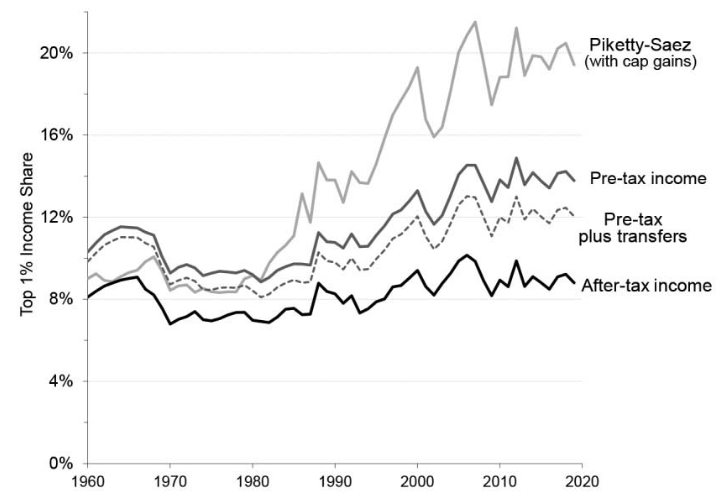
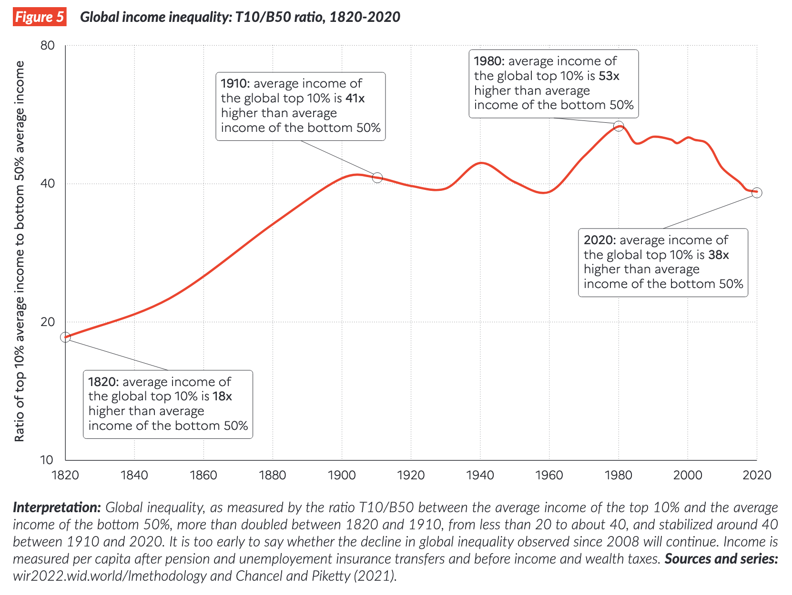
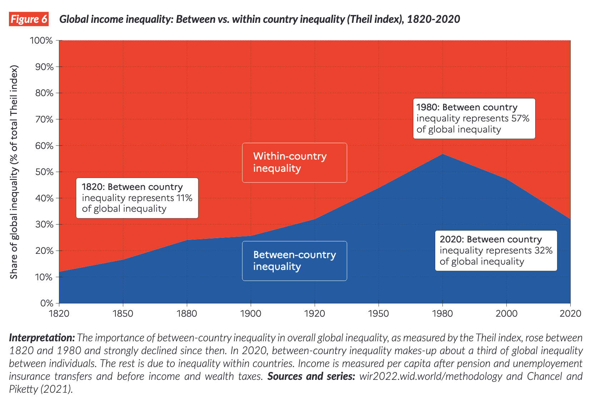
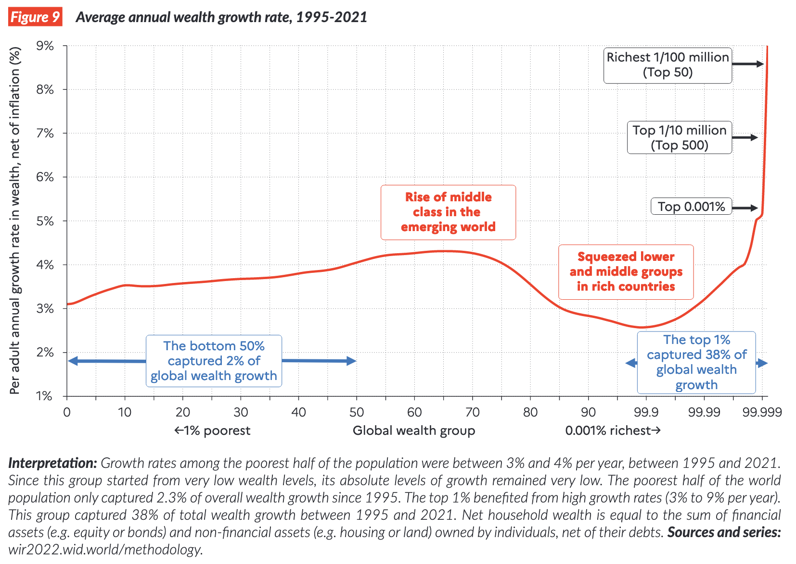

## Today's Plan

1.  Definitions
2.  Stylized facts about inequality
3.  Some explanations
4.  The readings

## How to measure inequality? {.smaller}

::::: columns
::: {.column width="80%"}
```{r}
library(ggplot2)
library(dplyr)
library(tidyr)

# Set seed for reproducibility
set.seed(42)

# 1. Define Population
N <- 100

# 2. Generate Distributions
# Scenario A: Low Inequality (Normal Distribution)
income_low <- abs(rnorm(N, mean = 100, sd = 50))

# Scenario B: Extreme Inequality (99 poor, 1 super rich)
income_extreme <- c(rep(1, N-1), 1000)

# 3. Function to Calculate Data & Gini
process_scenario <- function(income, name) {
  income <- sort(income)
  cum_pop <- c(0, (1:length(income)) / length(income))
  cum_inc <- c(0, cumsum(income) / sum(income))
  
  # Calculate Gini
  auc <- sum(diff(cum_pop) * (head(cum_inc, -1) + tail(cum_inc, -1))) / 2
  gini <- round(1 - (2 * auc), 3)
  
  data.frame(
    Cum_Pop = cum_pop,
    Cum_Income = cum_inc,
    Label = paste0(name, " (Gini: ", gini, ")")
  )
}

# 4. Combine Data
df_plot <- bind_rows(
  process_scenario(income_low, "Low Inequality"),
  process_scenario(income_extreme, "Extreme Inequality")
)

# 5. Define the Total Area Triangle (Denominator of Gini)
total_area_triangle <- data.frame(
  x = c(0, 1, 1), 
  y = c(0, 1, 0)
)

# 6. Plot
ggplot() +
  
  # LAYER 1: The Total Reference Area (Background Triangle)
  # This represents the total area under the Line of Equality (Area = 0.5)
  geom_polygon(data = total_area_triangle, aes(x = x, y = y), 
               fill = "grey90") +
  
  # LAYER 2: The Inequality Gap (Numerator of Gini)
  # Shading between the curve and the diagonal
  geom_ribbon(data = df_plot, 
              aes(x = Cum_Pop, ymin = Cum_Income, ymax = Cum_Pop, fill = Label), 
              alpha = 0.5) +
  
  # LAYER 3: The Lorenz Curves
  geom_line(data = df_plot, 
            aes(x = Cum_Pop, y = Cum_Income, color = Label), 
            linewidth = 1) +
  
  # LAYER 4: The Line of Equality (Diagonal Reference)
  geom_abline(intercept = 0, slope = 1, linetype = "dashed", color = "gray40") +
  
  # Formatting
  scale_x_continuous(labels = scales::percent, name = "Cumulative Share of Population", expand = c(0,0)) +
  scale_y_continuous(labels = scales::percent, name = "Cumulative Share of Income", expand = c(0,0)) +
  
  scale_fill_manual(values = c("firebrick", "steelblue")) +
  scale_color_manual(values = c("darkred", "navy")) +
  
  labs(
    title = "Lorenz Curves & Gini Coefficient",
    subtitle = "Grey Triangle: Total Area (Denominator)\nColored Area: Inequality Gap (Numerator)",
    fill = "Scenario",
    color = "Scenario"
  ) +
  
  theme_minimal() +
  theme(
    legend.position = "bottom",
    plot.title = element_text(face = "bold", size = 16),
    panel.grid.minor = element_blank()
  ) +
  coord_fixed()

```
:::

::: {.column width="20%"}
-   The gini coefficient is a measure of how different observed income
    distribution is from equal income distribution
-   You need to know the *full distribution*
:::
:::::

## Measuring inequality: Gini

-   If you have full distributions of income/wealth straightforward to
    calculate Gini as a summary statistic.

-   Depends strongly on the reference population: cohort, country,
    world?

[Consider where you are in global
income/wealth](https://wid.world/income-comparator/)

## Top X% incomes? {.smaller}

-   Common to see inequality measured as the percent of income/wealth
    held by the top .1/1/10% e.g. @alvaredo2013

-   This only requires detailed knowledge of

    -   Aggregate wealth/income

    -   The percentage of aggregate held by this percentile

-   **Still really difficult**

## Top X% incomes: some difficulties {.smaller}

-   Consider the debate between @piketty2018 and @auten2024 about US Top
    1% income share: why so different?



@auten2024, Figure 1

## Top X%: the debate over tax data {.smaller}

::: incremental
1.  Start with the national accounts data: all income

2.  Take national tax data and allocate national income to individuals
    based on their tax returns

3.  These will not add up:

    1.  Tax avoidance
    2.  Imputed values of living in owned home
    3.  Government spending?

4.  Make a series of judgments about how to allocate the missing bits

5.  ::: incremental
    Key disagreement between @piketty2018 and @auten2024 is 'allocating
    income not on tax returns' i.e. mostly tax evasion
    :::
:::

## The stylized facts on inequality: global income inequality {.smaller}

::::: columns
::: {.column width="30%"}
@worldin2022

-   Inequality *globally* rises across the 19th century
-   Falls in mid-20th and rises again
-   Measured as Top-10th/Bottom-50th
:::

::: {.column width="70%"}

:::
:::::

## The stylized facts on inequality: within vs between country {.smaller}

::::: columns
::: {.column width="30%"}
@worldin2022

-   This is *not* just a story about rich vs poor *countries*
:::

::: {.column width="70%"}

:::
:::::

## Global wealth growth rates: the 'elephant' curve {.smaller}

::::: columns
::: {.column width="30%"}
@worldin2022

-   Globally seems wealthy-nation middle classes may have been squeezed
    in last 30 years by poor-nation middle classes
:::

::: {.column width="70%"}

:::
:::::

## The much-debated search for causes

Technology:

-   "winner-takes-all" technologies
-   Skill-biased technical change

. . .

Politics:

-   Rent-seeking/de-regulation
-   dismantling unions/dismantling anti-trust
-   Tax policy
-   Feedback from wealth to policy

## The much-debated search for causes

Globalization:

-   Larger markets, bigger returns to scale?
-   Network technologies e.g. social networks?

. . .

Education:

-   The widening skills gap? (only really works for income not wealth)

. . .

The Piketty idea?

$r > g$

## Key questions  {.smaller}

> "the fact that high-income countries with similar technological and
> productivity developments have gone through different patterns of
> income inequality at the very top supports the view that institutional
> and policy differences play a key role in these transformations"
> [@alvaredo2013]

Do you agree?

How do @alvaredo2013 explain the fall and then subsequent rise of
inequality across the 20th century?

## Key questions

-   What is @milanovic2016 idea of a 'inequality possibility frontier'?

-   How does this relate to different inequality dynamics in 'societies
    with stagnant income' versus 'societies with a steadily rising mean
    income'?

-   Why does he think 'immiseration and inequality reduction' can go
    together?

## Works Cited
